# SmartParking

- **SmartParking** is a system to manage multiple **parking lots** located in different places
- A new parking lot can be added automatically to the system
- Every parking lot can have a variable number of **parkings** that are managed dynamically

- **Main features**

  - Car presence detection
  - Web App to show real-time data
  - Reserve a parking via Telegram bot
  - Close a parking lot

## **Materials**

### Master

- 1x NodeMCU 1.0 (ESP8266)
- 1x Infrared Remote Controller
- 1x Infrared Receiver
- 1x 16x2 characters LCD display + PCF8574 I2C converter
- 1x Servo Motor
- 1x Photoresistor
- 1x LED
- 1x 10kΩ Resistor
- 1x 200Ω Resistor

### Slave

- 1x NodeMCU 1.0 (ESP8266)
- 1x Photoresistor
- 1x LED
- 1x 10kΩ Resistor
- 1x 200Ω Resistor

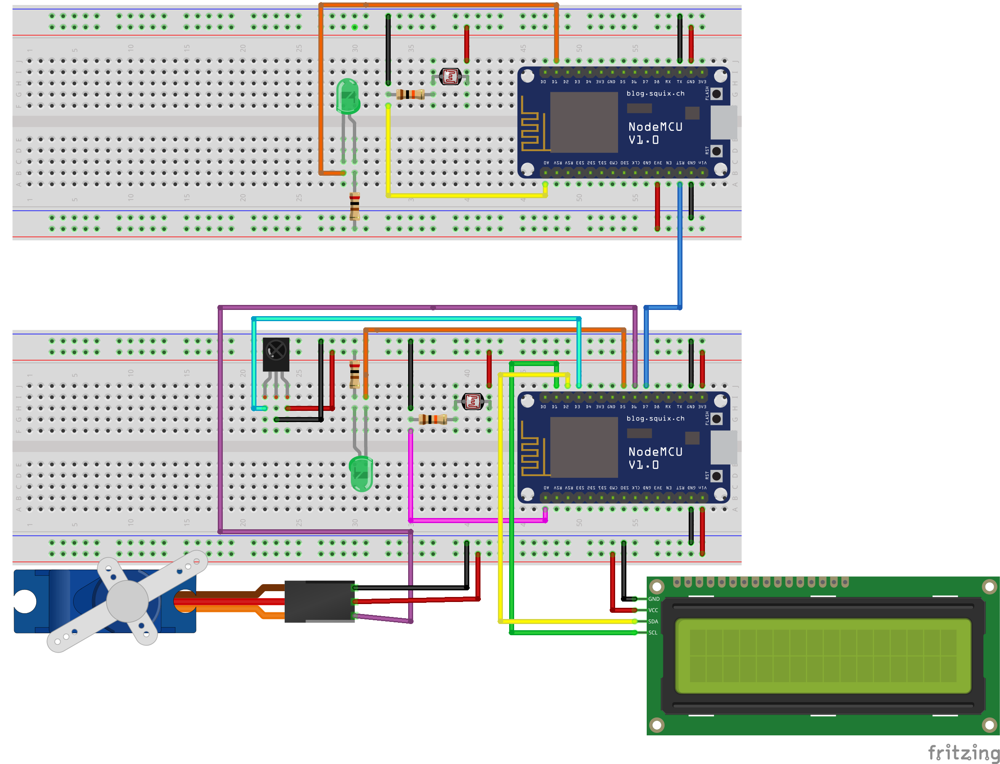

## How does it works?

- A **photoresistor** is placed under every parking to detect the presence of a car

  - When the light level is below a given threshold the parking is considered to be occupied 
  - The threshold is dynamically calculated taking into account the **time of day** (based on sunrise and sunset time) and **cloud level**

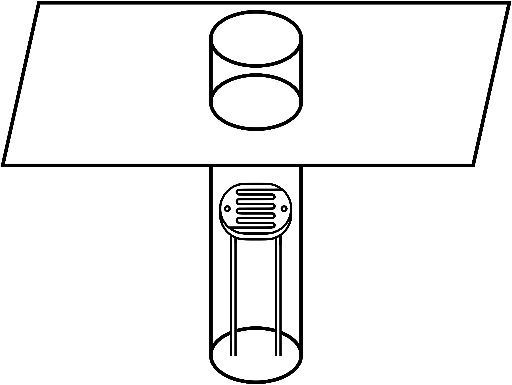

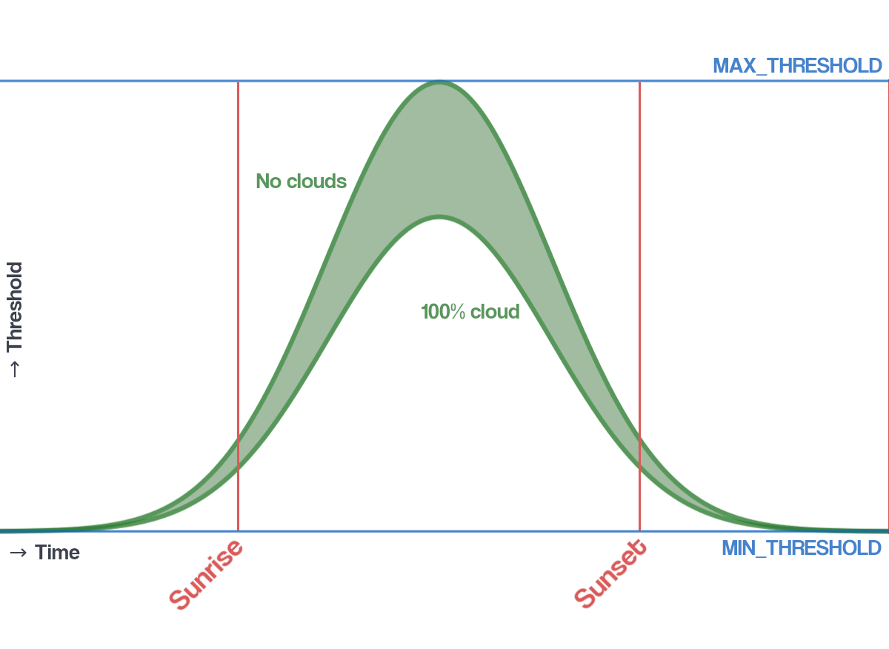

- A **LED** is placed in front of every parking

  - It turns off when the parking is occupied or booked
  - Otherwise it turns on meaning the parking is free

- The **bar** (servo motor) is opened when a car is detected (IR receiver and controller) 

- The **display** shows how many parkings are free or if the parking is closed

  

## **Architecture**

### Smart Network

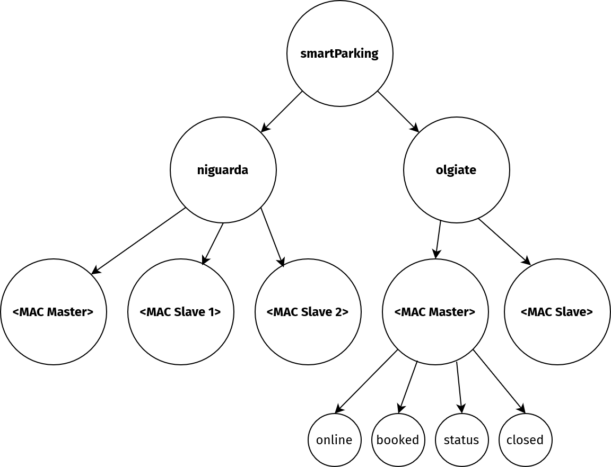

- *Masters* and *Slaves* communicate over **MQTT**

- The main topic is **smartParking** which has a subtopic for every parking lot

- Every parking lot has a subtopic for every parking which is identified by its MAC address

- Every parking publishes its informations on its topics

  - *online, booked, status, closed*

- The Master is subscribed to every topic relative to its parking lot

- A **Last Will** **message** informs that a parking has gone offline

- Every parking is subscribed to its topics **booked** and **closed**

  - When the Master receives the HTTP request to **close the parking lot**, it publish on every *closed* topic
  - When the Master receives the HTTP request to **book a parking**, it publish on *booked* topic of that parking

### Data Flow

- The Master writes its information (name, IP address, position…) in a **MySQL** table and logs data on **InfluxDB** (*total number of parkings*, *free parkings*...)

- **Flask** collects all data about the parking lots and their status

  - Flask reads the table on MySQL and retrieves the list of parking lots with their data
  - When something changes in the parking lot, the Master sends the new data to Flask via HTTP

- Flask sends data to **React** over **WebSocket**

- The **Telegram bot** receives data from Flask over HTTP

- Flask gets data from **OpenWeatherMap** to calculate the light threshold values

  

## **Web App**

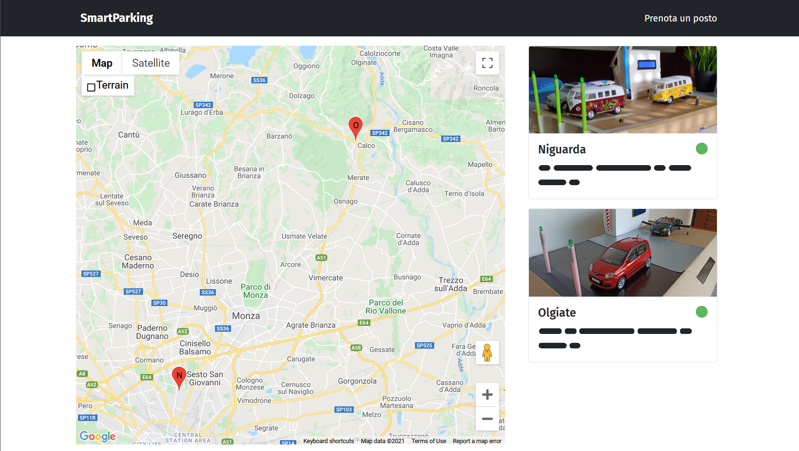

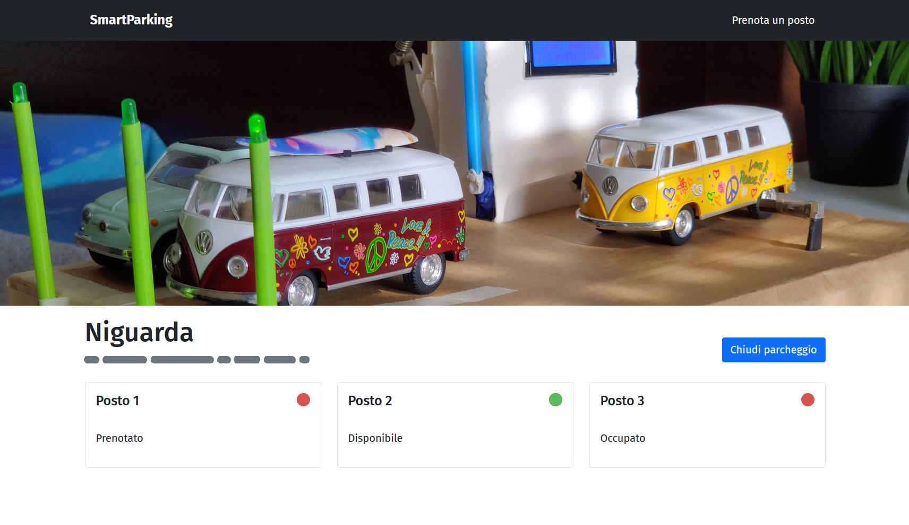

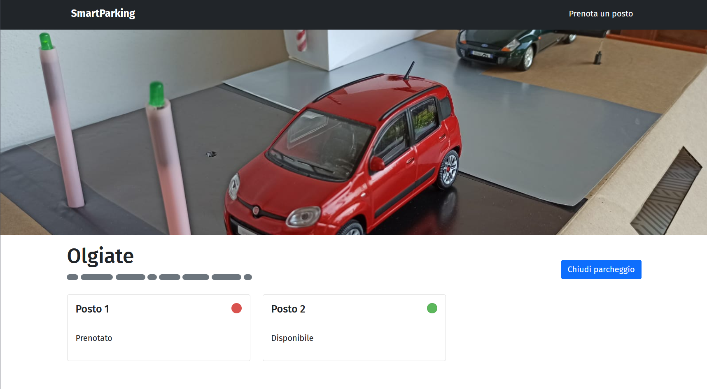

- **Homepage**
  
  - List of parking lots with their name, address and status (closed/offline)

  - Map to show the position of the parking lots

    

- **Parking lot page**

  - List of every parking with its real-time status (occupied/free/booked/offline)
  - A button to close/open the parking lot

## Telegram Bot

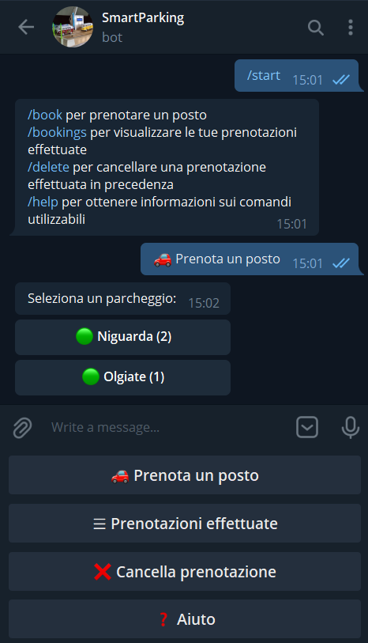

- **Features**

  - **Book a parking** in a chosen parking lot

    - The parking lots are shown with the number of available parkings
    - If a parking is closed or offline it is not shown

  - **List all the reservations** made by the user 

  - **Delete a reservation** made by the user

  - Get a list of available commands of the bot

## Power saving

1. When the parking is **closed**

   - The information is sent from React to Flask, which forwards it to the Master

   - The Master communicates it to its Slaves through MQTT

   - The Slaves go in **Deep Sleep** mode

   - The Master closes the bar, turns off the LED and shows on the display that the parking is closed

   - The Master has a pin connected to the reset pin of every Slave

   - Once the Slaves are sleeping, the Master can wake them up by acting on that pin

     

2. The new network architecture developed allows to save power by **avoiding continuous polling**

    - Data are sent only when it’s necessary

     

## Photos

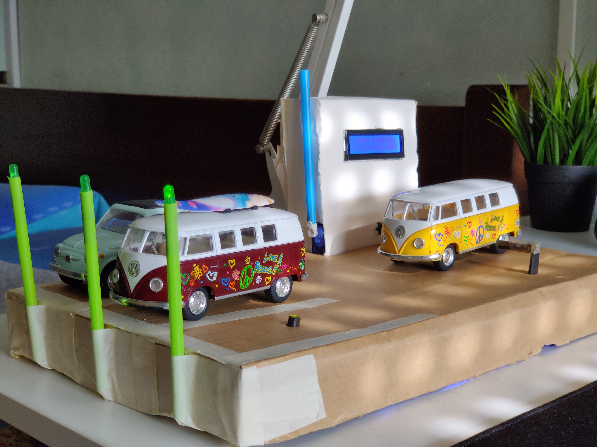

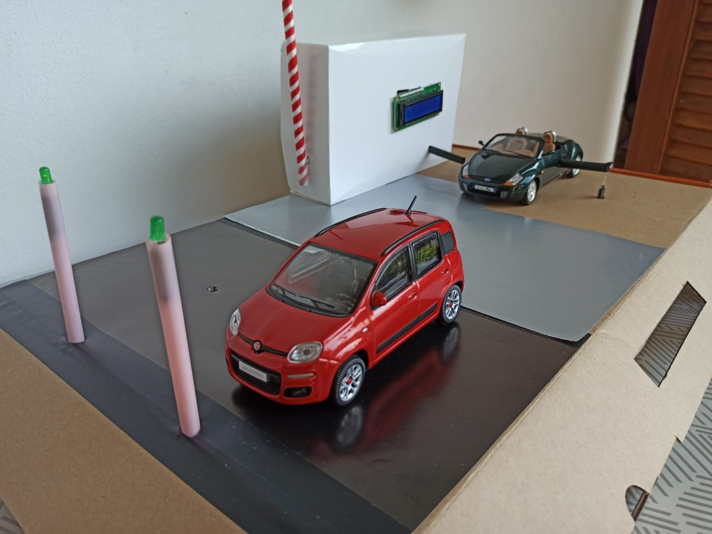

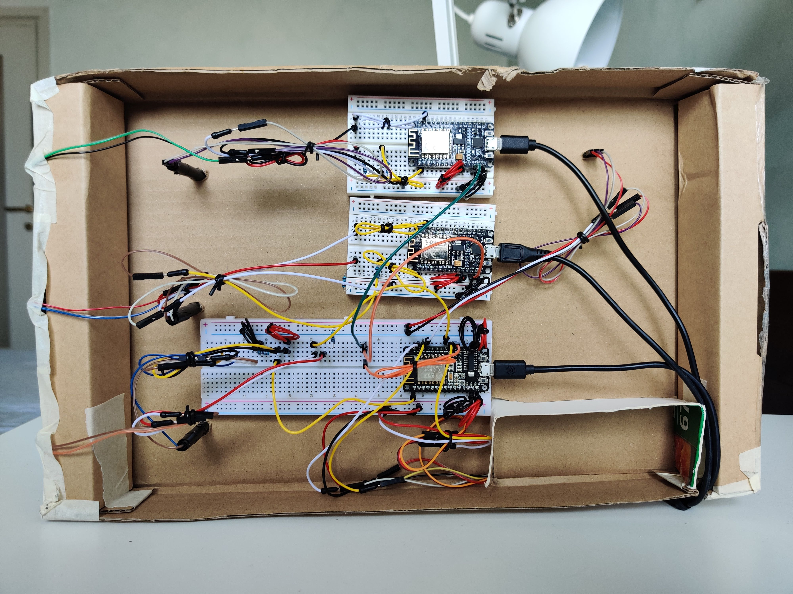

## Demonstration

https://drive.google.com/file/d/10leqn9YKZnGJIFO-FGl50tYBn3mypEFC/view?usp=sharing

https://drive.google.com/file/d/1RcJE63HJqObCmHVKbIIg2c1iB5pXCUZi/view?usp=sharing
